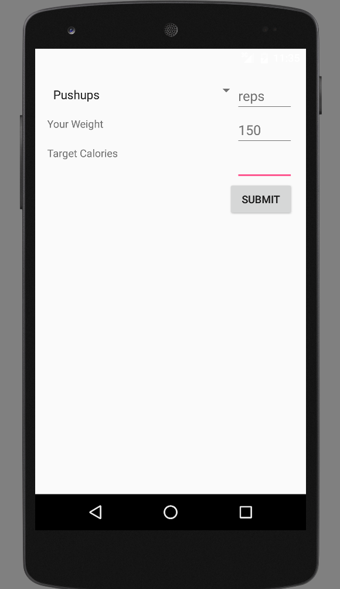

# PROG 01: Crunch Time

Briefly describe your app here.

## Authors

<<<<<<< HEAD
Kara Gieseking ([kgieseking@gmail.com](mailto:kgieseking@gmail.com))
=======
FirstName LastName ([your_email@berkeley.edu](mailto:your_email@berkeley.edu))
>>>>>>> 901ccdca34d6646d2d80fca0fe9d44d905a88b08

## Demo Video

See [your demo video title here] (https://link_to_your_video)

## Screenshots

<<<<<<< HEAD

## Acknowledgments

=======

## Acknowledgments

* Hat tip to anyone who's code was used
* Any other support
>>>>>>> 901ccdca34d6646d2d80fca0fe9d44d905a88b08

*Feel free to enhance your README. For Markdown syntax, see [the GitHub Guides](https://guides.github.com/features/mastering-markdown/). Remove this line in your submission.*
